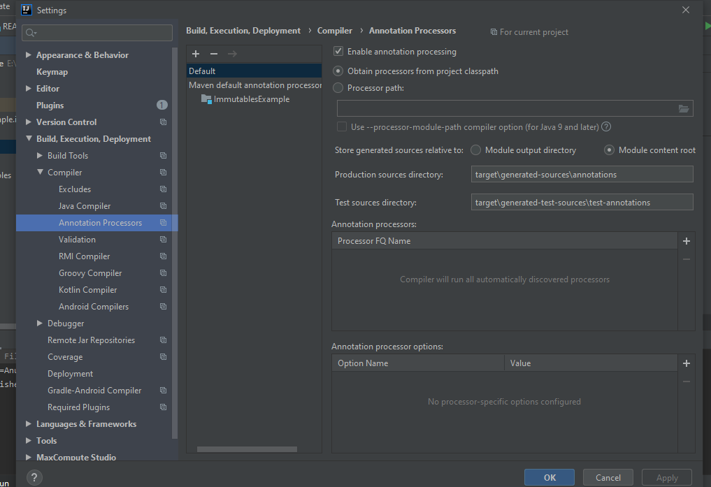

#User Guide

This project provides you an insight of using Immutables.
In this project I have created model.Book class and using Seller interface using immutable and created its object in MainClass. 
This library provides 2 examples one using Abstract class and other using Interface.

#Library uses [Immutables](https://immutables.github.io/) 
##Dependency
```xml
        <dependency>
            <groupId>org.immutables</groupId>
            <artifactId>value</artifactId>
            <version>2.8.2</version>
            <scope>provided</scope>
        </dependency>
```
Also need to add plugin in pom.xml
```xml
            <plugin>
                <groupId>org.apache.maven.plugins</groupId>
                <artifactId>maven-source-plugin</artifactId>
                <version>3.2.0</version>
                <executions>
                    <execution>
                        <id>attach-sources</id>
                        <phase>verify</phase>
                        <goals>
                            <goal>jar-no-fork</goal>
                        </goals>
                    </execution>
                </executions>
            </plugin>
```
#Configuring Intellij
For using Immutable with Intellij you need to configure Intellij like below:- 


